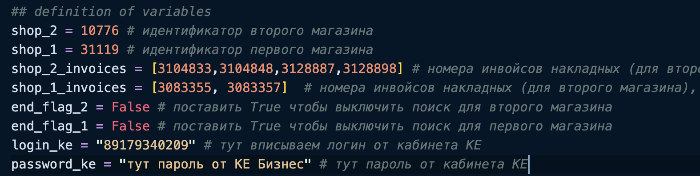
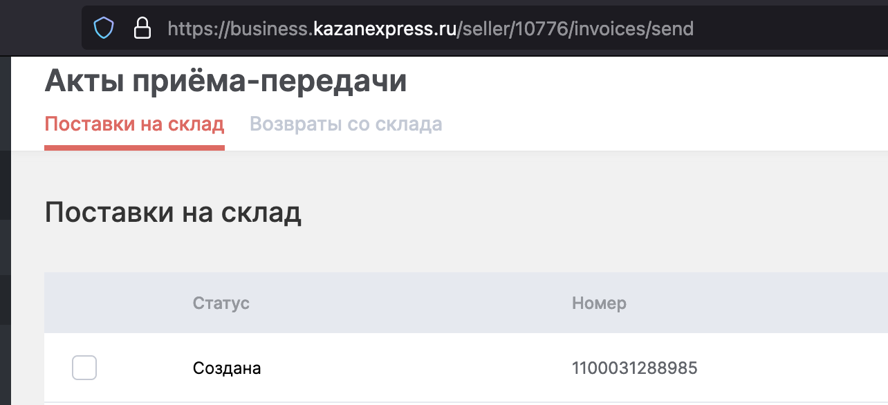
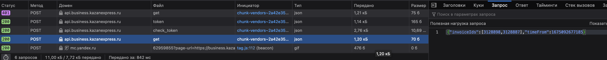
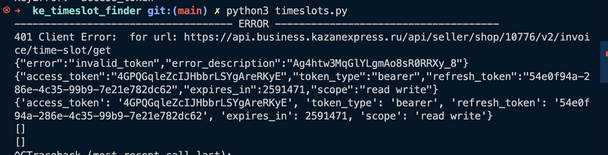

# ke_timeslot_finder
маленький скрипт для поиска таймслотов на КЕ

## Что должно стоять на компьютере

Для запуска данного скрипта нужен python3 и менеджер пакетов - pip3. Можно установить с сайта python - [Ссылка](https://www.python.org/downloads/)

после установки, надо выполнить в терминале установку пакетов для запуска скрипта:

```
pip install -r requirements.txt
```

## Что заменить в файле timeslots.py ?

В коде, в конце имеются строки содержащие в себе нужную информацию - номера накладных, логин и пароль от КЕ, идентификаторы магазинов. Они помечены комментариями - после символа `#` описаны эти параметры. Их  нужно настроить под свои параметры:



### Идентификатор магазина

Идентификатор магазина можно посмотреть на главной странице на странице КЕ Бизнес, а именно - на странице с накладными. На примере снизу, видно что в адресе есть цифра - 10776. Это и есть номер магазина.



### Идентификаторы накладных

Идентификаторы накладных - это номера накладных, но в урезанной форме: берутся цифры после нулей без последней цифры.
Пример:

```
1100031288879  = 3128887
```
Есть более простой способ узнать номера всех необходимых накладных - через инстурменты разработчка, надо посмотреть какие номера отправляются при попытке поиска таймслотов.

Для этого, открываем страницу КЕ Бизнес, правйо кнопкой вызываем инстурменты разработчика - "Просмотреть код" или "Исследовать" (смотря какой браузер). В мини вкладке "сеть" или "network" будут показаны все запросы до сервера. При попытке поиска таймслотов, будет сделан запрос `get`,  внутри вкладки запрос - будет список накладных.



## Особенности скрипта

Поиск идет для двух магазинов сразу. Как только находится слот для накладной, первый попавшийся слот резервируется. В этом случае, в логах будет фраза "DONE 1". 
Для выключения поиска одного магазина, нужно проставить `True`, в соответсвующую переменную.

## Запуск скрипта

После изменения всех параметров скрипта, запускаем скрипт командой:

```
python3 timeslots.py
```

Будет выглядеть примерно так:



Ждем поиска таймслотов. Лучше запускать в 11:00-11:10. 

Можно менять и запускать внутри pycharm, VS Code, или python IDE (если windows).